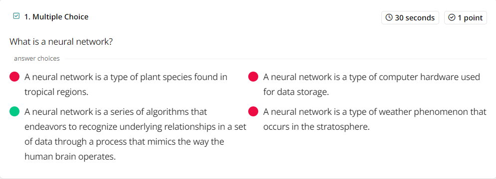
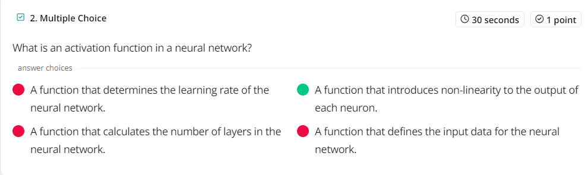
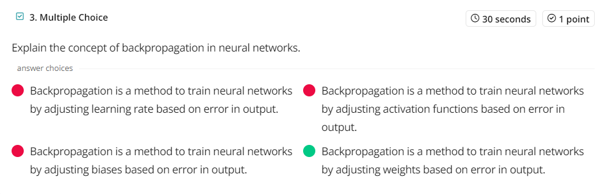
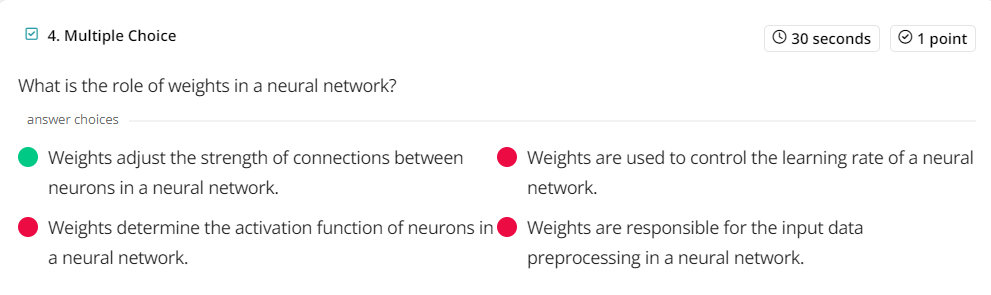
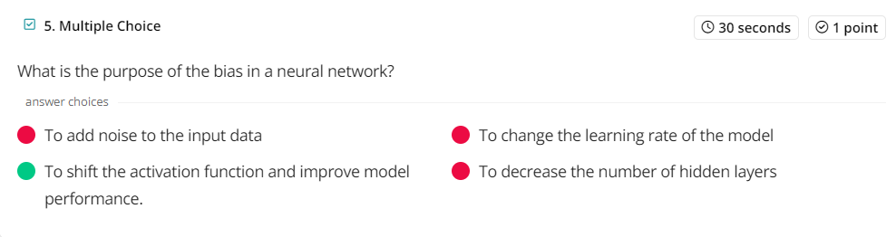
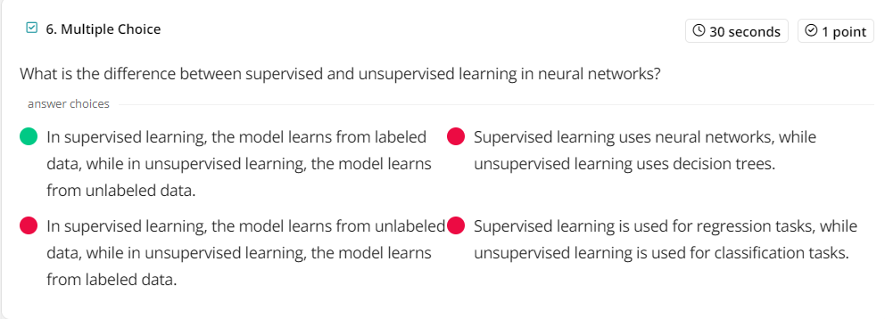
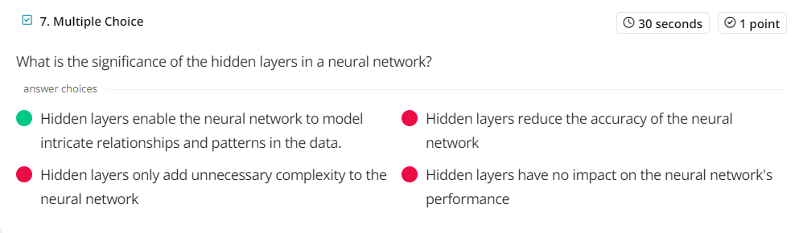
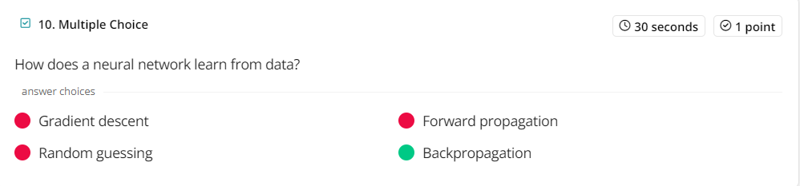

# Neural Networks

Nerual networks are sophisticated computational models inspired by the human brain. They have revolutionized machine learning and are widely used in various fields. This presentation will delve into the inner workings and applications of neural networks.

# Quiz

https://quizizz.com/join?gc=981875

